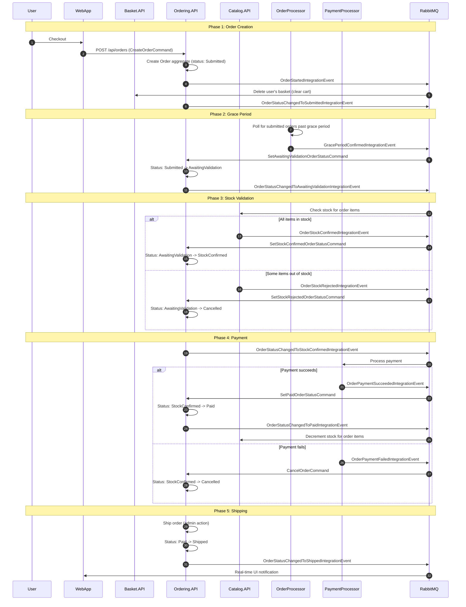
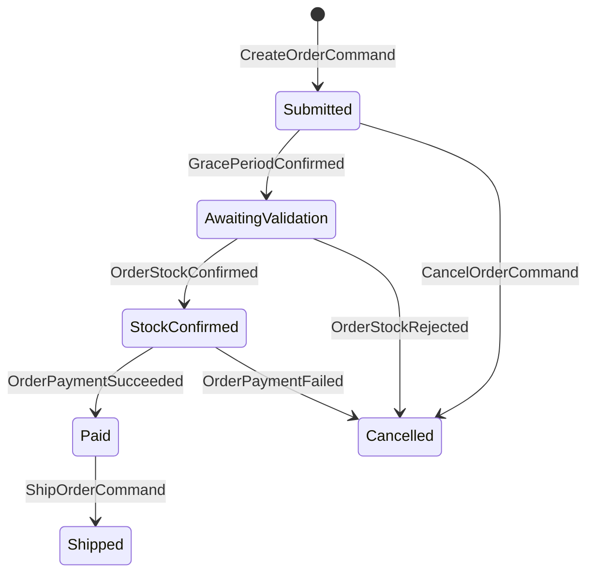
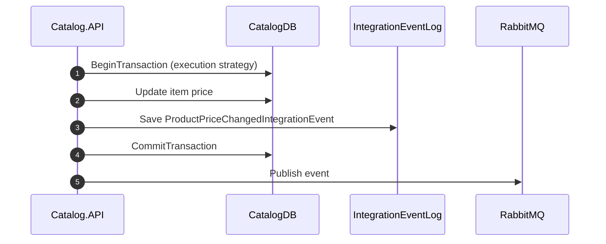

# Data Flow and Integration Events

## Integration Event Catalog

Every integration event extends `IntegrationEvent` (base: `Id`, `CreationDate`). Events are serialized as JSON and routed through RabbitMQ using the CLR type name as the routing key.

### Events Published by Ordering.API

| Event | Trigger | Payload | Consumers |
|-------|---------|---------|-----------|
| `OrderStartedIntegrationEvent` | `CreateOrderCommandHandler` completes | `UserId` | Basket.API (clears cart) |
| `OrderStatusChangedToSubmittedIntegrationEvent` | Buyer verification domain event handler | `OrderId`, `OrderStatus`, `BuyerName`, `OrderStockItems` | -- |
| `OrderStatusChangedToAwaitingValidationIntegrationEvent` | Status transition domain event handler | `OrderId`, `OrderStockItems` | Catalog.API (stock check) |
| `OrderStatusChangedToStockConfirmedIntegrationEvent` | Status transition domain event handler | `OrderId` | PaymentProcessor |
| `OrderStatusChangedToPaidIntegrationEvent` | Status transition domain event handler | `OrderId`, `OrderStockItems` | Catalog.API (decrement stock) |
| `OrderStatusChangedToShippedIntegrationEvent` | Status transition domain event handler | `OrderId` | WebApp (UI notification) |
| `OrderStatusChangedToCancelledIntegrationEvent` | Status transition domain event handler | `OrderId` | WebApp (UI notification) |

### Events Published by Catalog.API

| Event | Trigger | Payload | Consumers |
|-------|---------|---------|-----------|
| `ProductPriceChangedIntegrationEvent` | Catalog item price update | `ProductId`, `NewPrice`, `OldPrice` | -- |
| `OrderStockConfirmedIntegrationEvent` | Stock check passes for all items | `OrderId` | Ordering.API |
| `OrderStockRejectedIntegrationEvent` | One or more items have insufficient stock | `OrderId`, `OrderStockItems` (with confirmation flags) | Ordering.API |

### Events Published by OrderProcessor

| Event | Trigger | Payload | Consumers |
|-------|---------|---------|-----------|
| `GracePeriodConfirmedIntegrationEvent` | Submitted order exceeds grace period | `OrderId` | Ordering.API |

### Events Published by PaymentProcessor

| Event | Trigger | Payload | Consumers |
|-------|---------|---------|-----------|
| `OrderPaymentSucceededIntegrationEvent` | Payment succeeds | `OrderId` | Ordering.API |
| `OrderPaymentFailedIntegrationEvent` | Payment fails | `OrderId` | Ordering.API |

### Events Published by WebApp

The WebApp subscribes to order status change events for real-time UI updates via `OrderStatusNotificationService`. It does not publish events.

## Complete Order Lifecycle Flow

The following diagram shows the full lifecycle of an order from creation to shipment, including all inter-service communication:

## Order Status State Machine

## Domain Events (Within Ordering Bounded Context)

Domain events are in-process MediatR notifications dispatched before the database save. They enable reactions within the same transaction.

| Domain Event | Raised By | Handler Action |
|-------------|-----------|----------------|
| `OrderStartedDomainEvent` | `Order` constructor | Creates/updates `Buyer`, verifies payment method |
| `BuyerAndPaymentMethodVerifiedDomainEvent` | `Buyer.VerifyOrAddPaymentMethod` | Sets `PaymentMethodId` on `Order` |
| `OrderStatusChangedToAwaitingValidationDomainEvent` | `Order.SetAwaitingValidationStatus` | Enqueues `OrderStatusChangedToAwaitingValidationIntegrationEvent` |
| `OrderStatusChangedToStockConfirmedDomainEvent` | `Order.SetStockConfirmedStatus` | Enqueues `OrderStatusChangedToStockConfirmedIntegrationEvent` |
| `OrderStatusChangedToPaidDomainEvent` | `Order.SetPaidStatus` | Enqueues `OrderStatusChangedToPaidIntegrationEvent` |
| `OrderShippedDomainEvent` | `Order.SetShippedStatus` | Enqueues `OrderStatusChangedToShippedIntegrationEvent` |
| `OrderCancelledDomainEvent` | `Order.SetCancelledStatus` | Enqueues `OrderStatusChangedToCancelledIntegrationEvent` |

## RabbitMQ Topology

- **Exchange**: `eshop_event_bus` (type: direct)
- **Queues**: One durable queue per service, named by `EventBusOptions.SubscriptionClientName`
- **Bindings**: Each queue binds to the exchange with routing keys matching the event type names it subscribes to
- **Delivery**: Persistent (`DeliveryMode = 2`), mandatory, JSON body
- **Error handling**: Messages are always acknowledged after handler execution (no dead-letter exchange in this sample)
- **Retries**: Publisher-side retry with exponential backoff (Polly) for broker connectivity issues

## Catalog Price Change Flow

When a catalog item's price changes, the Catalog API publishes a `ProductPriceChangedIntegrationEvent` atomically with the database update using the outbox pattern:

