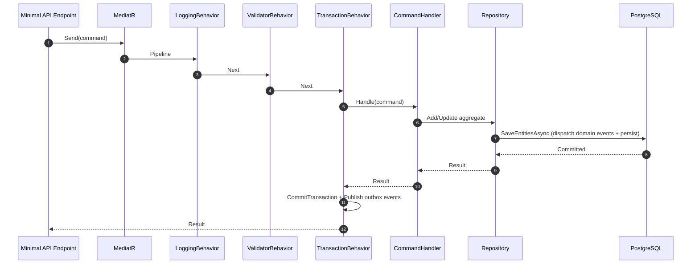
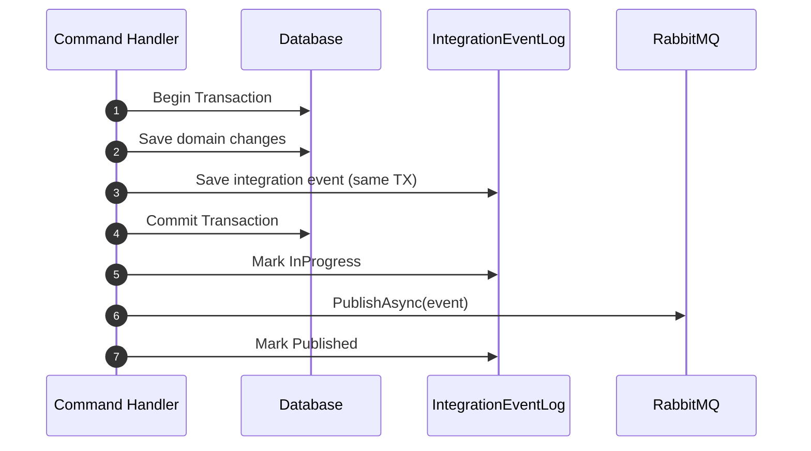

# Design Patterns and Architectural Decisions

## Domain-Driven Design (DDD)

The Ordering bounded context implements tactical DDD patterns. Other services (Catalog, Basket) use simpler CRUD or transaction-script approaches, which is a deliberate choice: DDD is applied where the business logic is complex enough to warrant it.

### Aggregates

An aggregate is a cluster of domain objects treated as a single unit for data changes. Every aggregate has a root entity through which all modifications flow.

| Aggregate | Root Entity | Child Entities | Value Objects |
|-----------|------------|----------------|---------------|
| **Order** | `Order` | `OrderItem` | `Address` |
| **Buyer** | `Buyer` | `PaymentMethod` | -- |

**Design decision**: `Order` and `Buyer` are separate aggregates despite being related. This prevents large transaction scopes and allows independent scaling. The link between them (`BuyerId` on `Order`) is an eventual-consistency reference resolved via domain events.

### Entities and Value Objects

- **Entities** (`Entity` base class): Have identity (`Id`), implement equality by identity, and carry a `DomainEvents` collection. Domain events are accumulated during aggregate operations and dispatched before persistence (`SaveEntitiesAsync`).

- **Value Objects** (`ValueObject` base class): Immutable, compared by structural equality via `GetEqualityComponents()`. Example: `Address` (street, city, state, country, zip).

- **Enumeration pattern**: `OrderStatus` uses a JSON string enum converter, allowing status values to be stored as readable strings in the database while maintaining type safety in code.

### Repository Pattern

Each aggregate root has a dedicated repository interface in the domain layer and an EF Core implementation in the infrastructure layer.

```
Domain:         IOrderRepository, IBuyerRepository (interfaces)
Infrastructure: OrderRepository, BuyerRepository   (EF Core implementations)
```

Repositories expose `IUnitOfWork` via their context, ensuring all changes within a request are committed atomically.

## CQRS (Command Query Responsibility Segregation)

The Ordering service separates write operations (commands) from read operations (queries).

### Write Path (Commands)



**MediatR pipeline behaviors** (executed in order):
1. **LoggingBehavior**: Logs request/response for observability.
2. **ValidatorBehavior**: Runs FluentValidation validators. On failure, throws `OrderingDomainException` wrapping `ValidationException`.
3. **TransactionBehavior**: Wraps the handler in an EF execution strategy + database transaction. After successful commit, publishes pending integration events from the outbox.

### Read Path (Queries)

Queries bypass MediatR entirely. `IOrderQueries` / `OrderQueries` project directly from EF entities to API DTOs (`Order`, `OrderSummary`, `CardType`). This avoids the overhead of the command pipeline for reads.

**Design decision**: Using EF directly for queries (rather than a separate read model or database) keeps the architecture simpler at the cost of some read scalability. For this scale, it is sufficient.

### Idempotency

Commands that come from external sources (HTTP, integration events) are wrapped in `IdentifiedCommand<T, R>`. The `IdentifiedCommandHandler` checks a `requests` table via `IRequestManager` before forwarding to the inner handler. Duplicate request IDs are short-circuited without re-executing the command.

**Important nuance**: `ValidatorBehavior` resolves validators by the exact `TRequest` type. When a command is wrapped in `IdentifiedCommand<CreateOrderCommand, bool>`, only `IdentifiedCommandValidator` runs (not `CreateOrderCommandValidator`). Inner command validation relies on domain model invariants in this case.

## Event-Driven Architecture

### Domain Events

Domain events represent something that happened within an aggregate. They are raised synchronously during aggregate operations and dispatched by `MediatorExtension.DispatchDomainEventsAsync` before `SaveChangesAsync`. This means domain event handlers run **within the same transaction** as the originating command.

**Design decision (dispatch before save)**: This ensures that side effects from domain event handlers (e.g., creating/updating the `Buyer` aggregate when an order starts) participate in the same transaction. The trade-off is that if a domain event handler fails, the entire transaction rolls back.

### Integration Events

Integration events cross service boundaries via RabbitMQ. They are distinct from domain events:

| Aspect | Domain Events | Integration Events |
|--------|--------------|-------------------|
| Scope | Within a bounded context | Across services |
| Transport | In-memory (MediatR `INotification`) | RabbitMQ |
| Consistency | Same transaction | Eventually consistent |
| Storage | Not persisted | Outbox table (`IntegrationEventLog`) |

## Transactional Outbox Pattern

The Ordering and Catalog services use the outbox pattern to ensure reliable event publishing:

1. Domain changes and integration event log entries are persisted in the **same database transaction**.
2. After commit, `TransactionBehavior` reads pending events from the log and publishes them to RabbitMQ.
3. Events are marked as `InProgress` before publishing and `Published` or `PublishedFailed` afterward.

This prevents the dual-write problem where a service updates its database but fails to publish the event (or vice versa).



## Saga Choreography

The order lifecycle is implemented as a **choreography-based saga** (no central orchestrator). Each service reacts to events and publishes its own:

```
CreateOrder → OrderStarted → [Basket clears cart]
           → OrderSubmitted → GracePeriodConfirmed → AwaitingValidation
           → [Catalog checks stock] → StockConfirmed/StockRejected
           → [Payment processes] → PaymentSucceeded/PaymentFailed
           → Paid → Shipped
```

**Design decision (choreography over orchestration)**: Each service remains autonomous. The trade-off is that the overall saga flow is implicit across services rather than defined in one place. This wiki's [Data Flow](data-flow.md) document maps the complete flow.

## Additional Patterns

### Specification Pattern (Implicit)

Aggregate methods like `Order.AddOrderItem` and `Order.SetCancelledStatus` enforce business invariants inline rather than using a formal Specification class. This is a pragmatic choice for a bounded set of rules.

### Unit of Work

`OrderingContext` implements `IUnitOfWork`. Repositories expose `UnitOfWork` so that command handlers can call `SaveEntitiesAsync()` once, committing all changes across multiple aggregates atomically.

### Resilient Transactions

`ResilientTransaction` (in `IntegrationEventLogEF`) wraps EF's execution strategy with explicit `BeginTransactionAsync`, enabling retry-safe transactions when the database connection is temporarily lost.

### Service Defaults (Convention over Configuration)

`eShop.ServiceDefaults` applies a consistent set of cross-cutting concerns (OpenTelemetry, health checks, HTTP resilience, JWT auth, OpenAPI) to every service via `AddServiceDefaults()`. This reduces per-service boilerplate and ensures observability is never accidentally omitted.
