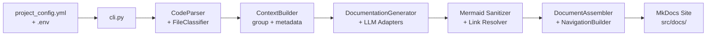

# Documentation Generator

The `doc_generator` is a Python pipeline that automatically generates developer documentation from .NET source code using LLMs. It parses source files, classifies them by architectural role, generates Markdown documentation via LLM prompts, and assembles the output into a MkDocs site.

## Architecture



## Pipeline Stages

### 1. Configuration (`config.py`)

`ConfigLoader` reads `project_config.yml` and `.env`:

| Section | Purpose |
|---------|---------|
| `repository` | URL, branch, `source_url_format` for GitHub links |
| `apis` | Per-API configuration (source paths, dependent libraries, display name) |
| `classification_rules` | Regex patterns mapping file paths to categories |
| `output` | `docs_dir`, `mkdocs_config` paths |
| `llm` | Provider (openai/claude/azure), model, temperature, max tokens |
| `template_examples` | Reference docs used as few-shot examples |
| `feature_detection` | Keywords for auto-detecting API features |

### 2. Parsing (`parsing/parser.py`, `parsing/classifier.py`)

**CodeParser** scans configured source paths:
1. Discovers files matching `file_extensions` (e.g., `*.cs`), excluding configured folders/files
2. Reads each file and creates a `FileInfo` with content, path, and metadata
3. Uses regex to extract: namespace, classes (with base class, interfaces, line numbers), methods (signature, line number, call list), properties
4. **FileClassifier** assigns a `category` to each file based on `classification_rules` (first matching regex wins)

Categories determine which prompt template generates the documentation (e.g., `command_handler` -> `handler_doc`, `api_endpoint` -> `feature_doc`).

### 3. Context Building (`generation/context.py`)

**ContextBuilder** prepares LLM inputs:

| Method | Purpose |
|--------|---------|
| `group_by_category` | Groups files by `(category, doc_file, doc_title)` |
| `build_class_metadata` | Structured summary: class name, kind, line number, source URL, methods with URLs, properties |
| `build_handler_context` | Handler/model info for feature doc prompts (class names, source URLs) |
| `build_component_summary` | High-level project summary for overview docs |
| `detect_features` | Auto-detects feature names from API endpoint method names |
| `api_folder_name` | Derives output folder from project name |

### 4. Generation (`generation/orchestrator.py`)

**DocumentationGenerator** coordinates the full pipeline per API:

1. Parse source and dependent library projects
2. Build `_source_prefix_map` for correct GitHub URLs
3. Group files by category
4. For each group: select prompt type, load template example, optionally chunk large groups, call LLM
5. Generate **feature pages** from API endpoint files (one page per detected feature)
6. Generate **dependent library docs** (e.g., Ordering.Domain, Ordering.Infrastructure)
7. Generate **overview page** last (with links to all generated pages)

### 5. LLM Interaction (`llm/adapters.py`, `llm/prompts.py`)

**Adapters**: `LLMFactory.create` returns an adapter for the configured provider:
- `OpenAIAdapter` (openai)
- `ClaudeAdapter` (anthropic)
- `AzureOpenAIAdapter` (azure)

Each adapter implements `generate(prompt, system_prompt)` -> `(text, truncated)`.

**Prompts**: Template functions per documentation category:

| Category | Prompt Function | Output Format |
|----------|----------------|---------------|
| `command_handler`, `domain_event_handler`, `query` | `handler_doc_prompt` | Per-class: overview, call graph, implementation flow |
| `aggregate` | `aggregate_doc_prompt` | Per-aggregate: overview, properties table, class diagram |
| `model`, `value_object` | `simple_doc_prompt` | Per-class: overview, optional properties table |
| `infrastructure` | `infrastructure_doc_prompt` | Per-class: overview, methods with flow diagrams |
| `api_endpoint` | `feature_doc_prompt` | Per-feature: sequence diagram, legend, dependencies |
| overview | `overview_doc_prompt` | Project overview with component links |

Each prompt includes:
- Output structure template
- Critical format rules
- Optional reference template (few-shot example)
- Class metadata and/or source code

### 6. Post-Processing

**In the orchestrator** (`_call_llm`):
- Strip markdown code fences from LLM output
- Strip echoed source code blocks
- Sanitize mermaid diagram syntax
- Retry on failure with exponential backoff

**In the assembler**:
- Build `{ref:ClassName}` cross-reference map from headings
- `LinkResolver.resolve_all`: fix internal cross-page links, validate GitHub URLs, fix hallucinated paths
- `fix_click_links_to_github`: correct mermaid click directives
- `fix_sequence_legends`: align legend formatting
- `fix_table_formatting`: normalize markdown tables

### 7. Assembly and Navigation (`output/assembler.py`, `output/navigation.py`)

**DocumentAssembler**:
1. Optionally clean previous output for the API
2. Apply all post-processing to generated markdown
3. Write files to `output.docs_dir`
4. Update MkDocs navigation

**NavigationBuilder.update_mkdocs_nav**:
- Loads `mkdocs.yml`
- Builds nav tree from generated file paths
- Merges with existing nav (new wins on conflict, `Home` first, sorted)
- Multiple API runs accumulate in the sidebar without wiping hand-crafted entries

## Running the Generator

```bash
# Generate docs for a single API
make generate API=ordering

# Generate docs for all APIs
make generate-all

# Dry run (parse + classify, no LLM calls)
make dry-run API=ordering

# Clean generated docs for an API
make regenerate API=ordering

# Serve the docs site
make serve
```

## Configuration Reference

### project_config.yml Structure

```yaml
repository:
  url: "https://github.com/org/repo"
  branch: "main"
  source_url_format: "{repo_url}/blob/{branch}/{file_path}#L{line}"

language: "csharp"
file_extensions: ["*.cs"]
exclude_folders: [bin, obj, Properties, Migrations]

apis:
  ordering:
    display_name: "Ordering API"
    source_paths: ["src/Ordering.API"]
    dependent_libraries: ["src/Ordering.Domain", "src/Ordering.Infrastructure"]

classification_rules:
  - pattern: "Apis/.*Api\\.cs$"
    category: "api_endpoint"
    doc_file: null        # Feature pages generated separately
  - pattern: "Commands/.*Handler\\.cs$"
    category: "command_handler"
    doc_file: "Commands.md"
    doc_title: "Commands"

output:
  docs_dir: "src/docs/docs"
  mkdocs_config: "src/docs/mkdocs.yml"

llm:
  provider: "openai"
  model: "gpt-4o"
  temperature: 0.2
  max_tokens: 4096
```

## Data Model

| Class | Purpose |
|-------|---------|
| `FileInfo` | Parsed file: path, content, category, classes, namespace |
| `ClassInfo` | Extracted class: name, kind, line number, base class, interfaces, methods, properties |
| `MethodInfo` | Method: name, signature, line number, call list |
| `PropertyInfo` | Property: name, type, line number |
| `ProjectInfo` | Collection of FileInfo for a project directory |
