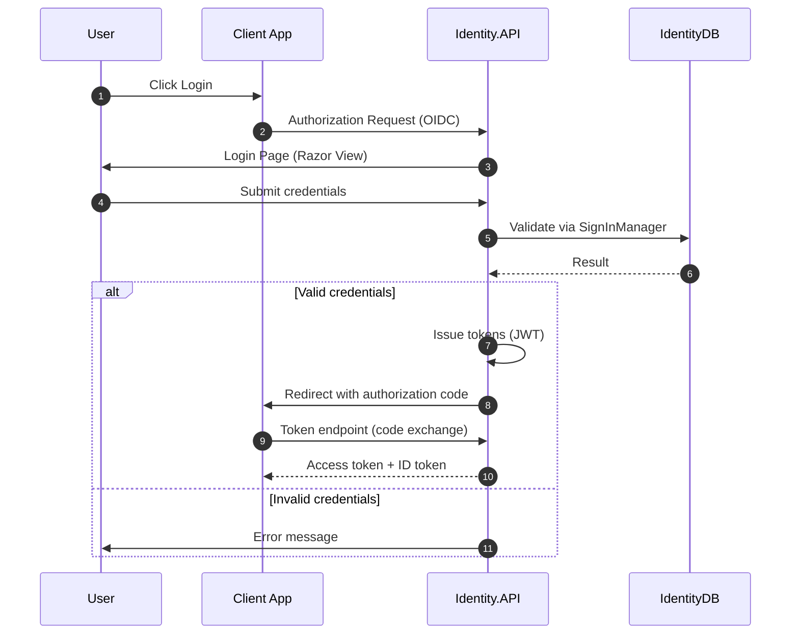

# Identity Service

The Identity.API is the authentication and authorization hub for the entire eShop platform. It combines ASP.NET Core Identity (user management) with Duende IdentityServer (OAuth2/OIDC token issuance) to provide login, consent, device authorization, and token endpoints.

## Project Structure

```
src/Identity.API/
├── Program.cs                           # Host pipeline
├── Configuration/Config.cs              # IdentityServer resources, scopes, clients
├── Models/ApplicationUser.cs            # Extended user entity
├── Data/ApplicationDbContext.cs         # Identity EF context
├── Services/                            # Login, profile, redirect services
├── Quickstart/                          # MVC controllers (Account, Consent, Device, etc.)
├── Views/                               # Razor views for auth UI
├── wwwroot/                             # Static assets (CSS, JS, images)
└── appsettings*.json
```

## Technology

- **Framework**: ASP.NET Core MVC (Razor views)
- **Identity**: ASP.NET Core Identity (`ApplicationUser`, `IdentityRole`)
- **Token Server**: Duende IdentityServer 7.x
- **Database**: PostgreSQL via EF Core
- **Authentication UI**: Server-rendered Razor pages (login, consent, device, grants)

## IdentityServer Configuration

### Resources and Scopes

| Type | Name | Description |
|------|------|-------------|
| Identity Resource | `openid` | Standard OpenID subject |
| Identity Resource | `profile` | User profile claims |
| API Scope | `orders` | Access to Ordering.API |
| API Scope | `basket` | Access to Basket.API |
| API Scope | `webhooks` | Access to Webhooks.API |
| API Resource | `orders` | Ordering API resource |
| API Resource | `basket` | Basket API resource |
| API Resource | `webhooks` | Webhooks API resource |

### Registered Clients

| Client ID | Flow | Scopes | Description |
|-----------|------|--------|-------------|
| `maui` | Authorization Code + PKCE | `openid`, `profile`, `orders`, `basket`, `webhooks`, `offline_access` | .NET MAUI mobile app |
| `webapp` | Authorization Code | `openid`, `profile`, `orders`, `basket`, `webhooks` | Blazor WebApp |
| `webhooksclient` | Authorization Code | `openid`, `profile`, `webhooks` | Webhooks demo client |
| Swagger clients | Implicit | Per-API scopes | API explorer UIs |

Token lifetimes: 2 hours for access and identity tokens. Refresh tokens available via `offline_access` scope.

### Signing Credentials

**Development**: `AddDeveloperSigningCredential()` generates `tempkey.jwk`. Key management is disabled (`KeyManagement.Enabled = false`).

**Production**: Requires a proper key material solution (HSM, Azure Key Vault, etc.). The code has explicit TODO comments for this.

## User Model

`ApplicationUser` extends `IdentityUser` with eShop-specific fields:

| Property | Purpose |
|----------|---------|
| `CardNumber` | Demo credit card number |
| `SecurityNumber` | Card CVV |
| `Expiration` | Card expiration |
| `CardHolderName` | Name on card |
| `CardType` | Card type (Visa, Mastercard, etc.) |
| `Street`, `City`, `State`, `Country`, `ZipCode` | Shipping address |
| `Name`, `LastName` | Display name |

These fields are emitted as claims by `ProfileService` for the checkout flow.

## Authentication Flows

### Login Flow



### Controllers

| Controller | Routes | Purpose |
|-----------|--------|---------|
| `AccountController` | `/Account/Login`, `/Account/Logout` | Local credential login/logout |
| `ExternalController` | `/External/*` | External identity provider integration |
| `ConsentController` | `/Consent` | OAuth2 scope consent screen |
| `DeviceController` | `/Device` | Device authorization flow (TV/IoT) |
| `GrantsController` | `/Grants` | View/revoke granted permissions |
| `DiagnosticsController` | `/Diagnostics` | Debug claims and tokens |
| `HomeController` | `/Home` | Landing page and error display |

### ProfileService

Custom `IProfileService` that loads `ApplicationUser` and emits claims:
- Standard: `sub`, `name`, `preferred_username`
- Address claims: street, city, state, country, zip
- Card claims: number, security, expiration, holder, type
- Security stamp validation for session validity

## Middleware Pipeline

```
AddServiceDefaults -> AddIdentity -> AddIdentityServer -> MapDefaultEndpoints
-> UseStaticFiles -> UseCookiePolicy -> UseRouting -> UseIdentityServer
-> UseAuthorization -> MapControllerRoute
```

**Cookie policy**: `MinimumSameSitePolicy = Lax` for Chrome SameSite compatibility.

## Database

`ApplicationDbContext` extends `IdentityDbContext<ApplicationUser>`. No custom tables beyond the standard ASP.NET Core Identity schema. Uses PostgreSQL via Aspire's `AddNpgsqlDbContext("identitydb")` with migration and seed data.

`UsersSeed` creates default test users on startup in development.

## DI Registration

- `AddServiceDefaults()` (OpenTelemetry, health, HTTP resilience)
- `AddNpgsqlDbContext<ApplicationDbContext>("identitydb")` + migration
- `AddIdentity<ApplicationUser, IdentityRole>` with EF stores
- `AddIdentityServer` with in-memory configuration from `Config.cs`
- `ILoginService<ApplicationUser>` -> `EFLoginService`
- `IRedirectService` -> `RedirectService`
- `IProfileService` -> `ProfileService`
