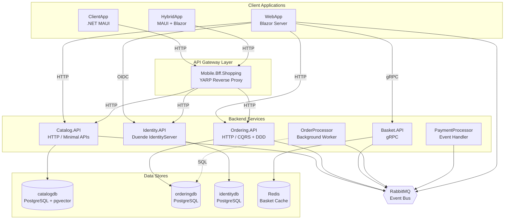

# System Overview

## What Is This System?

eShop is a **microservices-based e-commerce platform** built on .NET 8 and .NET Aspire. It demonstrates a production-grade architecture for online retail: browsing products, managing shopping carts, placing orders with payment processing, and managing user identity. The system also includes an **automated documentation generator** (Python) that uses LLMs to produce developer documentation from the source code.

## Technology Stack

| Layer | Technology |
|-------|-----------|
| **Runtime** | .NET 8, ASP.NET Core |
| **Orchestration** | .NET Aspire (AppHost) |
| **API protocols** | HTTP/REST (minimal APIs), gRPC |
| **Frontend** | Blazor Server (WebApp), .NET MAUI (ClientApp, HybridApp) |
| **Authentication** | Duende IdentityServer, OAuth2/OIDC, JWT Bearer |
| **Databases** | PostgreSQL (Ordering, Catalog, Identity), Redis (Basket) |
| **Messaging** | RabbitMQ via custom EventBus abstraction |
| **ORM** | Entity Framework Core + Npgsql |
| **AI/Embeddings** | pgvector, Ollama/OpenAI (optional catalog semantic search) |
| **Observability** | OpenTelemetry (traces, metrics, logs), OTLP export |
| **API Documentation** | MkDocs Material + Mermaid diagrams |
| **Doc Generation** | Python (OpenAI/Anthropic/Azure LLM adapters) |
| **Reverse Proxy** | YARP (Mobile BFF) |

## High-Level Architecture

## Service Inventory

### Backend APIs

| Service | Protocol | Database | Messaging | Purpose |
|---------|----------|----------|-----------|---------|
| **Ordering.API** | HTTP | PostgreSQL | RabbitMQ (pub/sub) | Order lifecycle management via CQRS/DDD |
| **Catalog.API** | HTTP | PostgreSQL + pgvector | RabbitMQ (pub/sub) | Product catalog CRUD and semantic search |
| **Basket.API** | gRPC | Redis | RabbitMQ (consumer) | Shopping cart management |
| **Identity.API** | HTTP (MVC) | PostgreSQL | None | OAuth2/OIDC token issuance and user auth |

### Background Processors

| Service | Role |
|---------|------|
| **OrderProcessor** | Polls for submitted orders past a grace period and publishes `GracePeriodConfirmedIntegrationEvent` |
| **PaymentProcessor** | Subscribes to stock-confirmed events and publishes payment success/failure events |

### Client Applications

| App | Technology | Backend Access |
|-----|-----------|---------------|
| **WebApp** | Blazor Server | Direct: gRPC (basket), HTTP (catalog, ordering), OIDC (identity) |
| **ClientApp** | .NET MAUI (XAML) | HTTP via gateway endpoints |
| **HybridApp** | MAUI + Blazor WebView | HTTP via Mobile BFF |

### Shared Libraries

| Library | Purpose |
|---------|---------|
| **EventBus** | Transport-agnostic event bus contracts and DI helpers |
| **EventBusRabbitMQ** | RabbitMQ implementation with Polly retries and OTel tracing |
| **IntegrationEventLogEF** | Transactional outbox pattern for EF Core contexts |
| **eShop.ServiceDefaults** | Shared OpenTelemetry, health checks, HTTP resilience, JWT auth, OpenAPI |
| **WebAppComponents** | Shared Blazor/Razor UI components (catalog UI, services) |

## Communication Patterns

The system uses three communication patterns:

1. **Synchronous HTTP/gRPC**: Client-to-service and service-to-service direct calls. Service discovery via .NET Aspire.

2. **Asynchronous Messaging**: RabbitMQ-based integration events for cross-service coordination (order status changes, stock validation, payment processing, basket cleanup).

3. **Transactional Outbox**: Ordering and Catalog APIs persist integration events atomically with domain changes, then publish after commit. This prevents lost messages when the broker is temporarily unavailable.

## Data Ownership

Each service owns its data store exclusively. No service reads another service's database directly. Cross-service data flows through integration events or synchronous API calls.

| Service | Data Store | Owns |
|---------|-----------|------|
| Ordering | PostgreSQL (`orderingdb`) | Orders, buyers, payment methods, request deduplication |
| Catalog | PostgreSQL (`catalogdb`) | Catalog items, brands, types, embeddings |
| Identity | PostgreSQL (`identitydb`) | Users, roles, IdentityServer operational data |
| Basket | Redis | Per-user shopping carts (JSON documents) |

## Aspire Orchestration

The `eShop.AppHost` project is the .NET Aspire orchestrator. It declares all infrastructure resources (PostgreSQL with pgvector, Redis, RabbitMQ) and all service projects, wiring connection strings, service discovery endpoints, and startup ordering (`WaitFor`) automatically.

See [Aspire Orchestration and Deployment](aspire-orchestration.md) for details.
